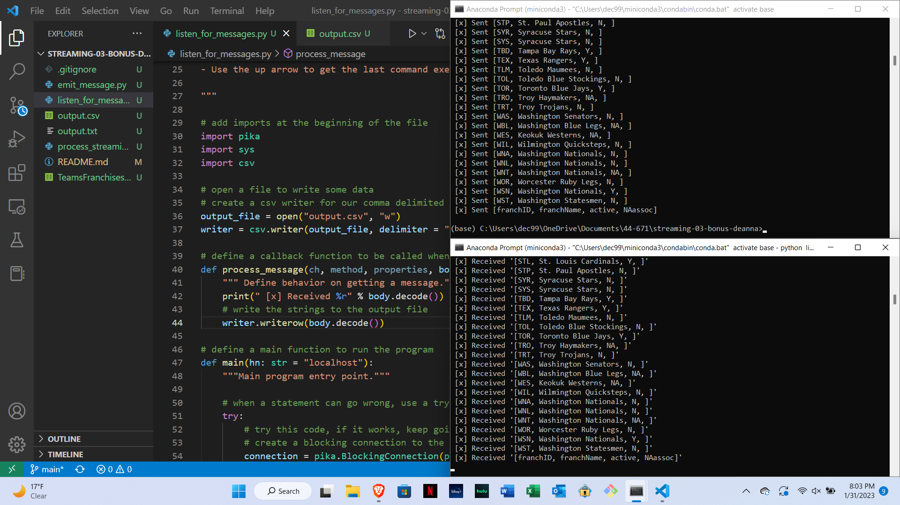

# streaming-03-bonus-deanna

Name: Deanna Clayton
Date: 1-30-23

Original Data retrieved from: https://www.kaggle.com/datasets/open-source-sports/baseball-databank 

This repo consists of:
1. A csv file containing data about baseball Team Franchises.
1. A producer that reads data from the csv file and writes a message to the bonus queue every 1 second.
1. A consumer that reads the messages from the bonus queue and writes the messages to a new file as they are received.

## Screenshot

